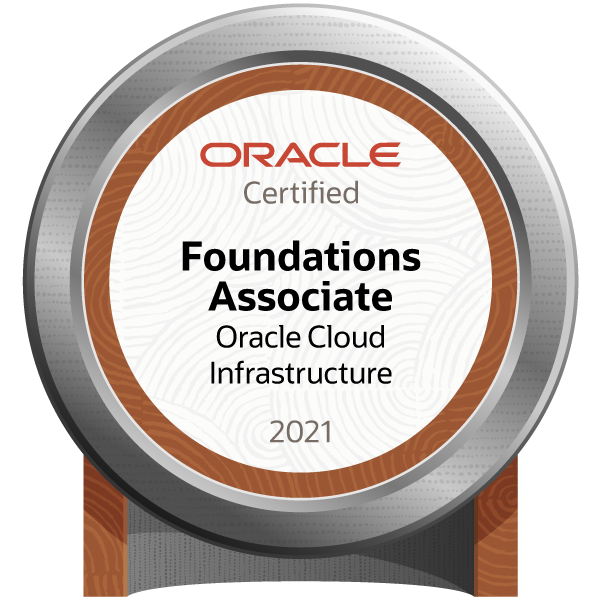
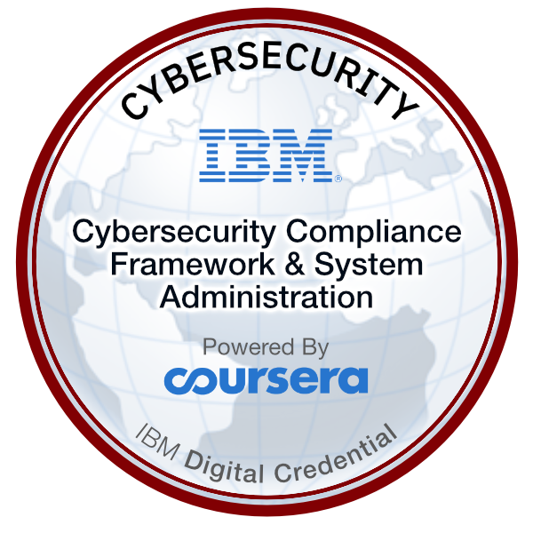
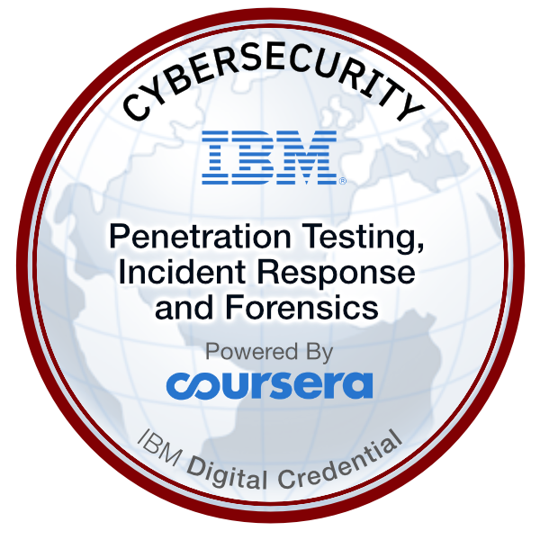
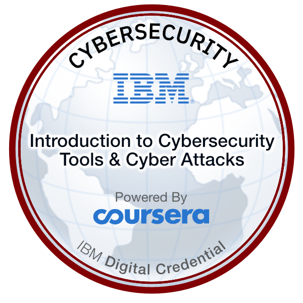
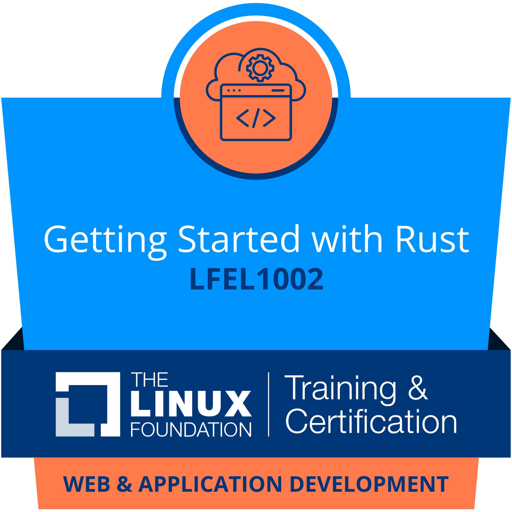

+++
title = "Portfolio"
sort_by = "weight"
+++

# About
Hi, I'm Vishal Rashmika, a highly motivated individual based in Sri Lanka. At 18 years old, I am currently a diligent student pursuing education in software development. With a keen interest in technology, I am committed to honing my skills and staying ahead of the curve in this ever-evolving industry.

<!-- >[Download Resume &#x2193;](./resume.pdf) -->
> <a href="./VishalRashmika-CV.pdf" target="_blank" style="color:black;">Download Resume&#x2193;</a>
---

# Projects
Innovative solutions crafted with passion. Explore my diverse projects that drive change and inspire.

- [Blossom Theme >>](/blossomtheme)
- [Life Via Lens >>](/lifevialens)

---

# Education
**October, 2024 – 2028 :** 
University of Central Lancashire 
<a href="https://www.uclan.ac.uk/undergraduate/courses/software-engineering-bsc" target="_blank">BSc (Hons) Software Engineering</a>

**July, 2023 – July, 2024 :** 
Universal College Lanka, 
<a href="https://ucl.lk/programs/ucl-international-foundation-year/" target="_blank">UCL International Foundation Year (UIFY)</a>

**April, 2014 – July, 2023 :** 
St. John Paul II College, Wennappuwa, Sri Lanka, 
Secondary Education

**December, 2019 – September, 2020 :** 
ESOFT, 
<a href="./DiTec.pdf" target="_blank">Level 3 diploma in technology(DITEC)</a>
<!-- <a href="">[Diploma in technology(DITEC)](./DiTec.pdf)</a> -->

**January, 2011 – May, 2014 :** 
St. James International School, Wennappuwa, Sri Lanka, 
Primary Education

# Achievements
🌸 Blossom Blender Theme — 1,800+ downloads

# Certifications
- <a href="https://trainingportal.linuxfoundation.org/learn/certificates/getting-started-with-rust-lfel1002?id=c0926af9-5118-44de-9375-2044853067aa" target="_blank">LFEL1002: Getting Started with Rust - The Linux Foundation</a>
- <a href="https://coursera.org/share/e38ff1e359cd20001a949f7e9baefde8" target="_blank">Advanced Learning Algorithms - DeepLearning.AI</a>
- <a href="https://coursera.org/verify/XQVFDJLAUZPQ" target="_blank">Linux For Developers - The Linux Foundation</a>
- <a href="https://code.sliit.org/certificates/fuyex8cgdu" target="_blank">AI/ML Engineer - Stage 1 - SLIIT</a>
- <a href="https://coursera.org/share/4a66565cf0325131533bb3d3f0d78437" target="_blank">Open Source Software Development Methods - The Linux Foundation</a>
- <a href="https://coursera.org/verify/PA3Z2UNXPZ7W/" target="_blank">Supervised Machine Learning : Regression and Classification - DeepLearning.AI</a>
- <a href="https://cs50.harvard.edu/certificates/4bbc4f6a-7e94-47cb-9acb-bae4689f60fa" target="_blank">CS50P - CS50</a>
- <a href="https://certificates.cs50.io/f2ca3ee3-1b32-4e3f-8f43-0154c6043ea6.pdf?size=letter" target="_blank">CS50x - CS50</a>
- <a href="https://www.coursera.org/verify/5G6TXRN8PK6N" target="_blank">Introduction to Cybersecurity Tools & Cyber Attacks - IBM</a>
- <a href="https://coursera.org/share/8e92b515c8080bcb1a50f2f1907dd5c5" target="_blank">Penetration Testing, Incident Response and Forensics - IBM</a>
- <a href="https://coursera.org/share/9daeecd4f6cc886b752866b77fb403c4" target="_blank">Cybersecurity Compliance Framework & System Administration - IBM</a>
- <a href="https://i.imgur.com/vBCNWR9.png" target="_blank">Advent of Cyber 2021 - Try Hack Me</a>
- <a href="https://i.imgur.com/PhY0dBU.png" target="_blank">Advent of Cyber 2022 - Try Hack Me</a>
- <a href="./umo-python-for-beginners.pdf" target="_blank">Python For Beginners - University Of Moratuwa</a>
- <a href="./umo-web-design-for-beginners.pdf" target="_blank">Web Design For Beginners - University Of Moratuwa</a>
- <a href="https://www.sololearn.com/Certificate/1014-24690347/jpg/" target="_blank">HTML - Sololearn</a>
- <a href="./oracle-certificate.pdf" target="_blank">Oracle Cloud Infrastructure Foundations 2021 Certified Associate - Oracle University</a>
- <a href="https://udemy-certificate.s3.amazonaws.com/pdf/UC-ae1fc27f-77fb-4593-80aa-01682523fce2.pdf" target="_blank">Ethical Hacking For Beginners - Udemy</a>
- <a href="https://coursera.org/share/20551d9bdc2e40943396dce48dac026e" target="_blank">Linux Fundamentals - Coursera</a>
- <a href="https://www.sololearn.com/Certificate/CT-7UBLMJEN/pdf" target="_blank">JavaScript - Sololearn</a>
- <a href="https://coursera.org/share/27bc3ace6f3757c8ea618482bae5095e" target="_blank">Algorithmic Toolbox - University of California San Diego</a>

# Badges
 

  

    
  

  

    
  

  

    
  

  

    
  

  

    
  

 

# Blog
- [Paper - HackTheBox Writeup](https://blog.vishalrashmika.com/posts/paper/)
- [Disecting a Simple x86-64 bit Assembly Hello World Program](https://blog.vishalrashmika.com/posts/breaking-down-asm-helloworld/)
- [Bounty Hunter - TryHackMe Writeup](https://blog.vishalrashmika.com/posts/bounty-hunter/)

[`Visit my Blog >>`](https://blog.vishalrashmika.com)

# Contact Me
- <a href="mailto:vishal@vishalrashmika.com">Email : vishal@vishalrashmika.com</a>
- <a href="https://gist.githubusercontent.com/VishalRashmika/44d9469f7d65fc4c5245d13ebd0f9fea/raw/f35ee26cc859a115970701739d7d2fbdf86f97c0/public_key.asc" target="_blank">Public Key</a>
- <a href="https://www.linkedin.com/in/vishalrashmika/" target="_blank">Linkedin</a>
- <a href="https://www.instagram.com/j.m.v.r.p/" target="_blank">Instagram</a>
- <a href="https://github.com/VishalRashmika" target="_blank">Github</a>
- <a href="https://twitter.com/Vishal_Rashmika" target="_blank">Twitter</a>
- <a href="https://behance.net/vishalrashmika" target="_blank">Behance</a>
- <a href="https://medium.com/@VishalRashmika" target="_blank">Medium</a>
<!-- - <a href="https://web.facebook.com/jmvishalrashmika/" target="_blank">Facebook</a> -->
<!-- - <a href="https://stackoverflow.com/users/18637594/vishalrashmika" target="_blank">Stackoverflow</a> -->
<!-- - public key -->
# Donate
 
<!-- [BTX](https://sth) 
[monero](https://sth)  -->

